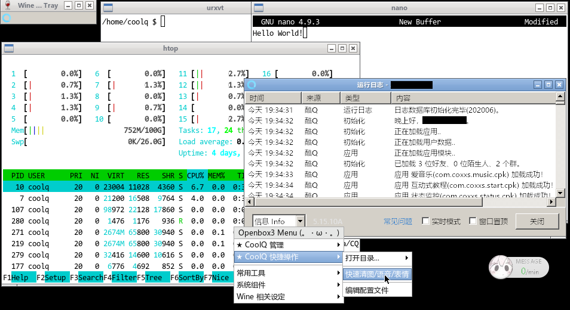

# docker-coolq-alpine

[](#)
[](#)

A lightweight coolq docker container based on Alpine Linux.



## Features
 - Simple way to deploy
 - Smaller image size and memory
 - Customized Openbox menu for CoolQ

## Get started
> **Hint:** Please make sure you have installed docker and docker-compose first.

> **Hint:** You could set your preferences by editing the `docker-compose.yml` file, like access ports, CoolQ releases, persistent data locations \_(:3) z)\_

```bash
  $ docker-compose build && \
    docker-compose up -d
  # Enjoy! (｡･∀･)ﾉﾞ
```

## TODOs
- [ ] CoolQ reboot menu
- [ ] Chinese input built-in
- [ ] Replace x11vnc with noVNC
- [ ] Find the way to using original `winhttp.dll` (more compatible)

## License
licensed under GPL-3.0 ❤
